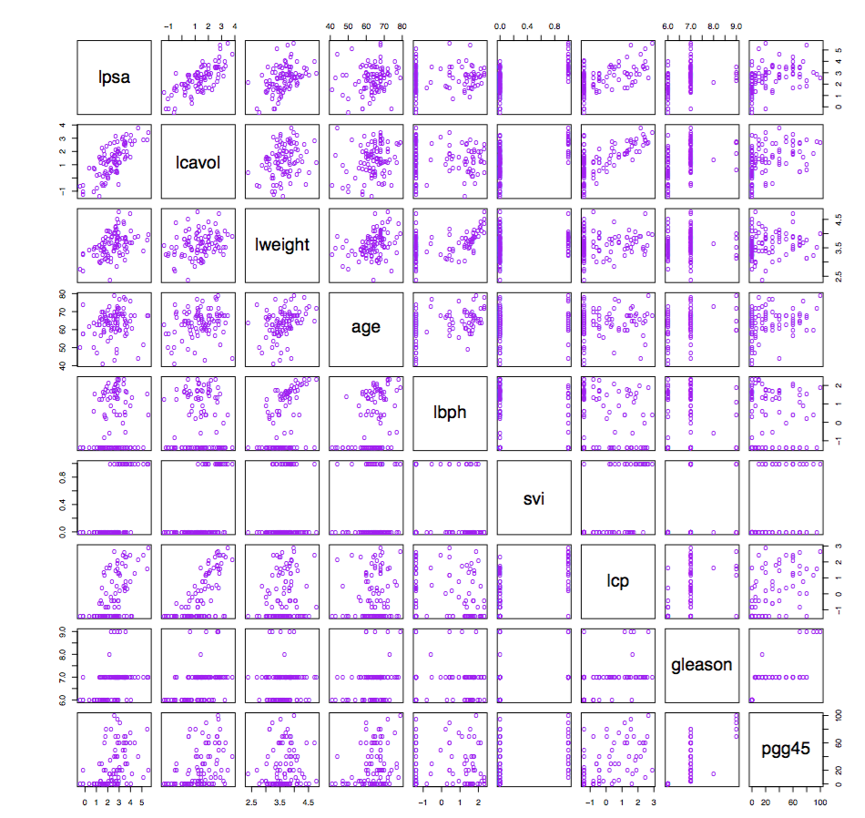
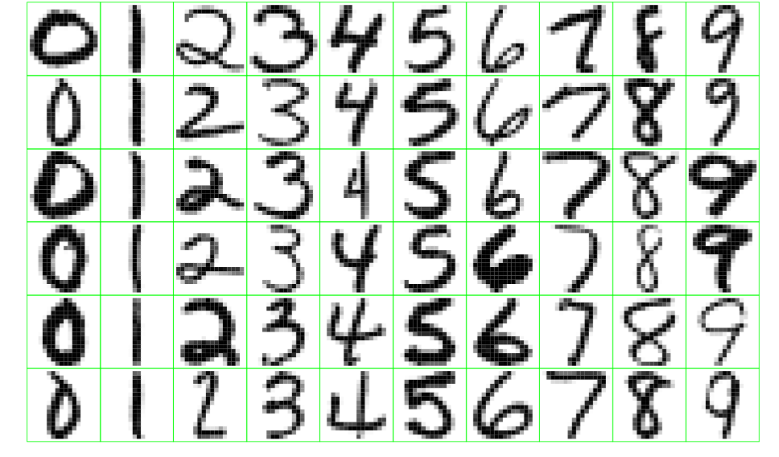
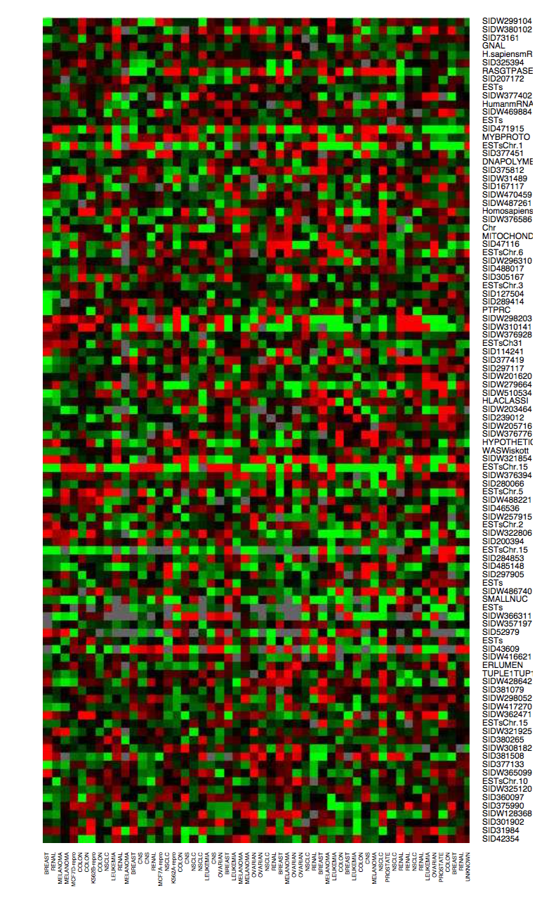
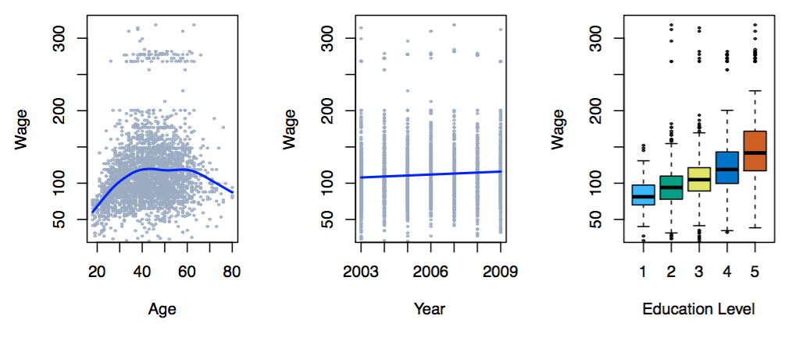

```{r setup, include=FALSE}
knitr::opts_chunk$set(echo = FALSE)
```

# People

- Randy Lai (aka "Chu Shing Lai")
- Office: Neville Hall 334
- Office Hour: MWF 11:00-12:00 (tentatively)

# Course Description

Focus on linear and nonlinear statistical models. Emphasis on concepts, methods, and data analysis;
formal mathematics kept to minimum. Topics include resampling methods, regularization techniques in
regression and modern classification, cluster analysis and dimension reduction techniques. Use
professional level software.

# Logistics

- Course material (lectures slides, homeworks, etc.): https://bb.courses.maine.edu
- 5-6 assignments (work in groups!?)
- final project and presentation (kaggle competitions?)

# Text

- (Primary) *Introduction to Statistical Learning* by James, Witten, Hastie, and Tibshirani: download at http://www-bcf.usc.edu/~gareth/ISL
- *Computer Age Statistical Inference* by  Efron and Hastie: download at 
https://web.stanford.edu/~hastie/CASI/
- *Elements of Statistical Learning* hy Hastie,    Tibshirani,
    and Friedman: download at http://www-stat.stanford.edu/ElemStatLearn
    
# Why you are here?
- Because you love the subject, because it's required, because you eventually want to make \$
- No matter the reason, (I wish) everyone can get something out of the course


# Outline

- Introduction
- Statistical Learning
- Linear Regression
- Classification
- Resampling Methods
- Linear Model Selection and Regularization
- Moving Beyond Linearity
- Tree-Based Methods
- Support Vector Machines
-  Unsupervised Learning
-  Neural Networks
- Anything else?

# A brief history of Statistical learning

- At the beginning of the nineteenth century, Legendre and Gauss published papers on the
method *method of least square*
- Fisher proposed *linear discriminant analysis* in 1936
- In the 1940s, various authors introduced *logistic regression*
- In the early 1970s, Nelder and Wedderburn proposed generalized linear models
- In the late 70s/early 80s, Wahba published papers on *spline models*
- In mid 1980s Breiman, Friedman, Olshen and Stone introduced *classification and regression trees*

# A brief history of Statistical learning (cont')

- Hastie and Tibshirani coined the term *generalized additive models* in 1986
- Since then, inspired by the advent of *machine learning* and other disciplines,
statistical learning has emerged as a new subfield in statistics, focused on *supervised*
and
*unsupervised* modeling and prediction


# Supervised Learning

Supervised learning: making predictions

- we have training data $(X_1, Y_1), \ldots, (X_n, Y_n)$ to learn a model in order to
    predict $Y$ from $X$
- outcome measurement $Y$ (also called dependent variable, response, target).
- vector of $p$ predictor measurements $X$ (also called inputs, regressors, covariates,
    features, independent variables)
- In the regression problem, Y is quantitative

- In the classification problem, Y takes values in a finite, unordered set


# Unsupervised learning

Unsupervised learning: discovering structure

- given measurements $X_1, \ldots, X_n$, learn some underlying group structure based on
similarity

- no outcome variable, just a set of predictors (features) measured on a set of samples

- objective is more fuzzy

- difficult to know how well your are doing.

- different from supervised learning, but can be useful as a pre-processing step for
    supervised learning
    
# Example 1
Identify the risk factors for prostate cancer.

```{r echo=FALSE, out.width='60%'}

```

# Example 2

Handwritten Digit Recognition: The data from this example come from the handwritten ZIP codes on
envelopes from U.S. postal mail. Each image is a segment from a five digit ZIP code, isolating a
single digit.


```{r echo=FALSE, out.width='60%'}

```


# Example 3
Classify a tissue sample into one of several cancer classes, based on a gene expression profile.

- which samples are most similar to each other?
- which genes are most similar to each other?
- do certain genes show very high (or low) expression for certain cancer samples?


```{r echo=FALSE, out.width='30%'}

```

# Example 4

Establish the relationship between salary and demographic variables in population survey data.


```{r echo=FALSE, out.width='80%'}

```


# Statistical Learning vs Machine Learning

- Machine learning arose as a subfield of Artificial Intelligence.
- Statistical learning arose as a subfield of Statistics.
- There is much overlap -- both fields focus on supervised and unsupervised problems:
- Machine learning has a greater emphasis on large scale applications and prediction accuracy.
- Statistical learning emphasizes models and their interpretability, and precision and uncertainty.
- But the distinction has become more and more blurred, and there is a great deal of “cross-fertilization”.
- Machine learning has the upper hand in Marketing!
