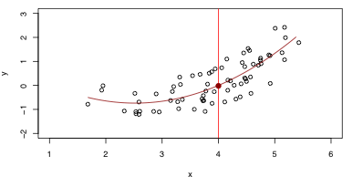
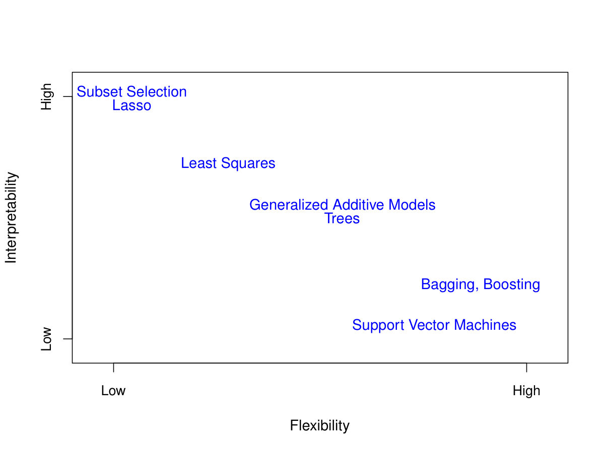

```{r setup, include=FALSE}
knitr::opts_chunk$set(echo = FALSE)
```

# Motivating Example

*income* dataset

```{r echo=FALSE, out.width='40%'}

```

Can we predict Income using these two variables?

$$
    \texttt{Income} \approx f (\texttt{Years of Education}, \texttt{Seniority})
$$

# Statistical Model

- here Sales is a response or target that we wish to predict. We generically refer to the
    response as $Y$.

- *Years of Education* is a feature, or input, or predictor; we name it $X_1$.
Likewise name \texttt{Seniority} as $X_2$, and so on.

- We can refer to the input vector collectively as

$$
    X = \left(\begin{array}{c}
    X_1\\ X_2 \\ X_3
    \end{array}
\right)
$$

Now we write our model as
$$
Y = f(X) + \varepsilon
$$
where $\varepsilon$ captures all discrepancies


# Why estimating $f$?

There are two main reasons that we may wish to estimate $f$: **prediction**
and **inference**.


# Prediction

- We can predict $Y$ using $\hat Y = \hat f(X)$
- In this setting, $\hat f$ is often treated as a *black box*
- In general, $\hat f$ will not be a perfect estimate for $f$, and this inaccuracy will introduce some error.

    The accuracy of $\hat Y$ as a prediction for $Y$ depends on two quantities, which we will call the
    *reducible error* and the *irreducible error*.
-  For any estimate $f(x)$ of $f(x)$, we have

$$
    E[(Y-\hat f(X))^2 | X= x] = \underbrace{ E[f(X) - \hat f(X)]^2}_{\text{Reducible}} + \underbrace
    {Var (\varepsilon)}_{\text{Irreducible}}
$$


### Ideal Prediction
- The ideal $f(x)=E(Y|X=x)$ is called the regression function
- $f(x)$ is the function that minimizes $E[(Y - g(X))^2|X = x]$ over all functions $g$ at all points
$X = x$.

# Inference
- Which predictors are associated with the response?

- What is the relationship between the response and each predictor?

- Can the relationship between Y and each predictor be adequately summarized using a linear equation, or is the relationship more complicated?


# How to estimate $f$
- Our goal is to apply a statistical learning method to the training data
in order to estimate the unknown function $f$.

- In other words, we want to find a function $\hat f$ such that $Y \approx \hat f(X)$ for any
observation $(X,Y)$.

- Broadly speaking, most statistical learning methods for this task can be characterized as either *parametric* or *non-parametric*.

# Parametric methods

- The linear model is an important example of a parametric model:
$$
f(X) = \beta_0 + \beta_1 X_1 + \ldots + \beta_p X_p
$$

- A linear model is specified in terms of $p + 1$ parameters
- We estimate the parameters by fitting the model to
training data.

- Although it is almost never correct, a linear model often serves as a good and interpretable approximation to the unknown true function $f(X)$.

# Linear models with higher order terms

A simple linear model $\hat f (X) = \beta_0 + \beta_1 X$ gives a reasonable fit here

```{r echo=FALSE, out.width='40%'}

```

A quadratic model $\hat f (X) = \beta_0 + \beta_1 X+ \beta_2 X^2$ fits slightly better.


```{r echo=FALSE, out.width='40%'}

```

# Non-parametric methods

- we know $E(Y |X = x)$ is the ideal estimator
- typically we have few if any data points with $X = x$ exactly.
-so we cannot estimate $E(Y |X = x)$
- relax the definition and let
$$
    \hat f(x) = \text{Ave}(Y | X \in \mathcal{N}(x))
$$
- $\mathcal{N}(x)$ is come neighborhood of $x$
- also called "local averaging"
- We will discuss smoother versions, such as kernel and spline smoothing later in the
        course.

# Curse of Dimensionality

- Nearest neighbor averaging can be pretty good for small $p$ — i.e. $p \le 4$ and large
        $n$.

-  Nearest neighbor methods can be lousy when $p$ is large. Reason: the curse of
        dimensionality. Nearest neighbors tend to be far away in high dimensions.

- check http://en.wikipedia.org/wiki/Volume_of_an_n-ball


# Parametric vs Non-Parametric methods

**income** data revisit


```{r echo=FALSE, out.width='30%'}


```

# Overfitting

```{r echo=FALSE, out.width='30%'}

```

- The same thin-plate spline fit using a lower level of smoothness, allowing for a rougher fit.
- The resulting estimate fits the observed data perfectly!
- However, the spline fit shown is far more variable than the true function $f$.
- This is an example of overfitting the da

# Prediction accuracy versus interpretability

- Linear models are easy to interpret; thin-plate splines are not.
- Good fit versus over-fit or under-fit.
- How do we know when the fit is just right?
- Parsimony versus black-box.
- We often prefer a simpler model involving fewer variables over a black-box predictor involving them all.

# Various methods --- Interpretability vs Flexibility


```{r echo=FALSE, out.width='70%'}

```

# Assessing Model Accuracy

- Suppose we fit a model $f(x)$ to some training data
$Tr = \{x_i, y_i\}_{i=1}^n$, and we wish to see how well it performs.
- We could compute the average squared prediction error over Tr

$$
    \text{MSE}_{Tr} = \text{Ave}_{i \in Tr} [y_i - \hat f(x_i)]^2
$$

- This may be biased toward more overfit models.

- Instead we should, if possible, compute it using fresh test data $Te=\{x_i,y_i\}_{i=1,m}$

$$
    \text{MSE}_{Te} = \text{Ave}_{i \in Te} [y_i - \hat f(x_i)]^2
$$

- also referred to "in-sample" and "out-of-sample" errors
- a.k.a. MSPE (P for prediction)


# $\text{MSE}_{Tr}$ vs $\text{MSE}_{Te}$


```{r echo=FALSE, out.width='70%'}

```

$\text{MSE}_{Tr}$: grey  vs $\text{MSE}_{Te}$: red'


# $\text{MSE}_{Tr}$ vs $\text{MSE}_{Te}$ - an almost linear function


```{r echo=FALSE, out.width='70%'}

```

$\text{MSE}_{Tr}$: grey  vs $\text{MSE}_{Te}$: red'


# $\text{MSE}_{Tr}$ vs $\text{MSE}_{Te}$ - a rough function


```{r echo=FALSE, out.width='70%'}

```

$\text{MSE}_{Tr}$: grey  vs $\text{MSE}_{Te}$: red'


# Bias-Variance trade offs

-  Suppose we have fit a model $\hat f(x)$ to some training data Tr, and let
    $(x_0, x_1)$ be a test observation drawn from the population. If the true model is
$$
    Y = f(X) + \varepsilon
$$

-  then

$$
    E\left(y_0 - \hat f(x_0)\right)^2 = Var\left(\hat f(x_0)\right) + \left[Bias\left(\hat f
        (x_0)\right)\right]^2  + Var(\varepsilon)
$$

- Typically as the flexibility of $\hat f$ increases, its variance increases, and its bias
    decreases. So choosing the flexibility based on average test error amounts to a bias-variance
    trade-off.

# Previous example


curve vs almost linear vs rough