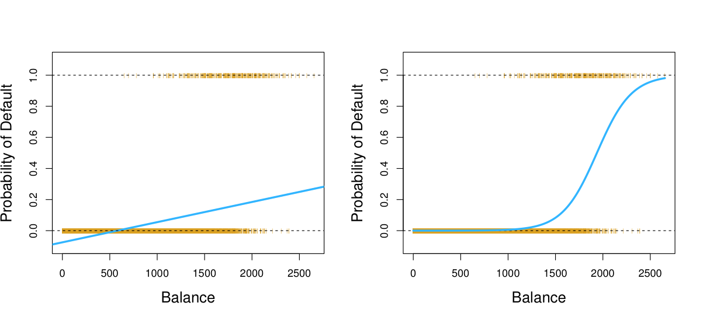
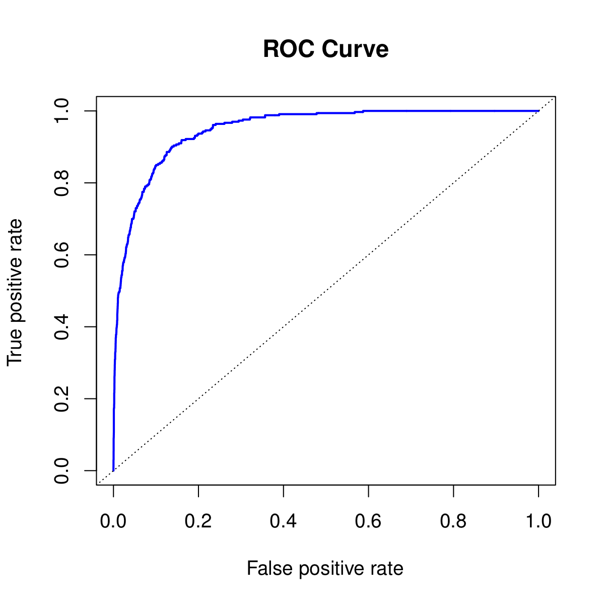
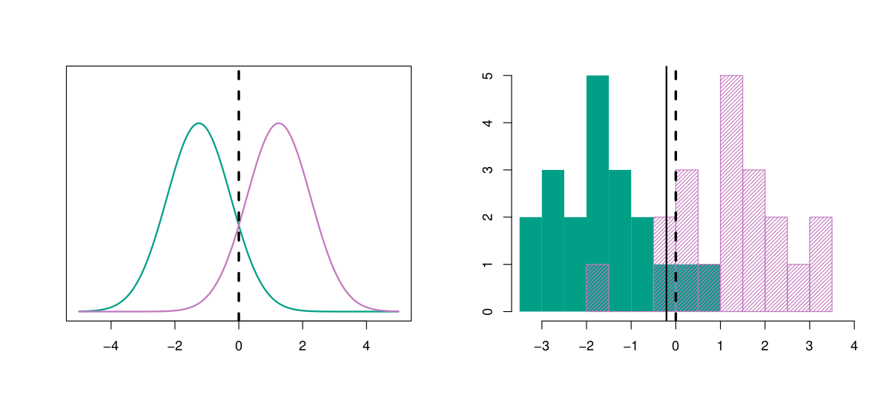
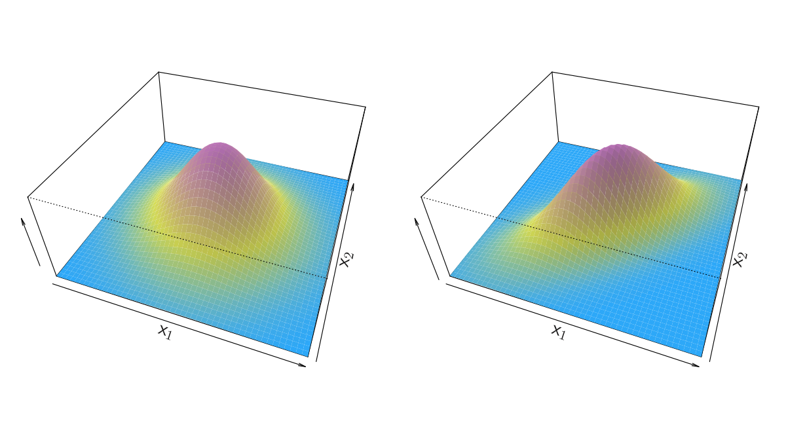
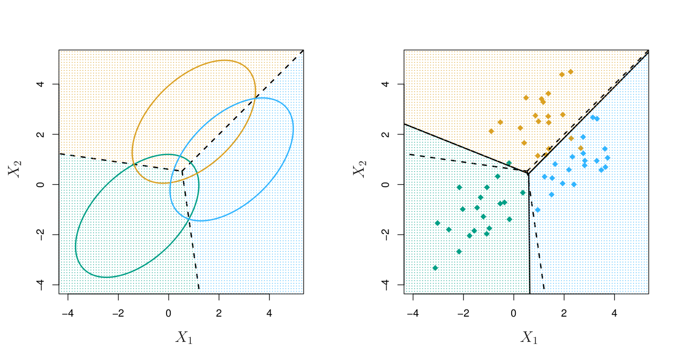

```{r setup, include=FALSE}
knitr::opts_chunk$set(echo = FALSE)
```


# Classification

Classification is a predictive task in which the response takes values across discrete categories (i.e., not continuous), and in the most fundamental case, two categories

Examples:

- Predicting whether a patient will develop breast cancer or remain healthy, given genetic information

- Predicting whether or not a user will like a new product, based on user covariates and a history of his/her previous ratings

- Predicting the region of Italy in which a brand of olive oil was made, based on its chemical composition

- Predicting the next elected president, based on various social, political, and historical measurements

# Classification (cont.)

- Qualitative variables take values in an unordered set $C$, such as: eye color:
{brown,blue,green}, email: {spam,ham}

- given a feature vector $X$ and a qualitative response $Y$ taking values in the set $C$, the classification task is to build a function $C(X)$ that takes as input the feature vector $X$ and predicts its value for $Y$ ; i.e. $C(X) \in C$.

- Often we are more interested in estimating the probabilities that $X$ belongs to each category in $C$.

- For example, it is more valuable to have an estimate of the probability that an insurance claim is fraudulent, than a classification fraudulent or not.

# Can we use Linear Regression?

- Suppose for the Default classification task that we code
$$
Y = \begin{cases}
    0, &\text{ if "No"}\\
    1, &\text{ if "Yes"}
\end{cases}
$$

- Can we simply perform a linear regression of $Y$ on $X$ and  classify as  "Yes" if $\hat Y > 0.5$?

- In this case of a binary outcome, linear regression does a good job as a classifier, and is equivalent to linear discriminant analysis which we discuss later.
- However, linear regression might produce probabilities less than zero or bigger than one. Logistic regression is more appropriate.


# Linear versus Logistic Regression

```{r echo=FALSE, out.width='80%'}

```

The orange marks indicate the response $Y$, either 0 or 1. Linear regression does not estimate $P(Y = 1|X)$ well. Logistic regression seems well suited to the task.

# Linear Regression continued

Now suppose we have a response variable with three possible values. A patient presents at the emergency room, and we must classify them according to their symptoms.

$$
    Y = \begin{cases}
        0, &\text{ if "stroke"}\\
        1, &\text{ if "drug overdose"}\\
        2, &\text{ if "epileptic seizure"}\\
    \end{cases}
$$

- This coding suggests an ordering, and in fact implies that the difference between stroke and drug overdose is the same as between drug overdose and epileptic seizure.
- Linear regression is not appropriate here. Multiclass Logistic Regression or Discriminant Analysis are more appropriate.


# Logistic Regression

- Let’s write $p(x) = P(Y = 1|X=x)$ for short and consider using $X$ to predict $Y$. Logistic regression uses the form

$$
p(x) = \frac{\exp(\beta_0+\beta_1 x_1 + \ldots)}{1+\exp(\beta_0+\beta_1 x_1 + \ldots)}
$$

- note that $0<p(x)<1$

$$
    \text{logit}[p(x)] = \log \left(\frac{p(x)}{1-p(x)}\right) = \beta_0+ \beta_1 x_1 + \ldots
$$

- $\frac{p(x)}{1-p(x)} = \frac{P(Y = 1|X=x)}{P(Y = 0|X=x)}$ is the odds

- logistic regression assumes that the log odds is linear in $x$

# Maximum Likelihood

- Given a sample $(x_i,y_i), i = 1,\ldots,n$, we fit the coefficients by maximizing the log
likelihood
$$
l(\beta_0,\beta) = \prod_{i:y_i=1} p(x_i) \prod_{i:y_i=0} [1-p(x_i)]
$$

- This likelihood gives the probability of the observed zeros and ones in the data. We pick
   $\beta_0$ and $\beta$ to maximize the likelihood of the observed data.

- Most statistical packages can fit linear logistic regression models by maximum likelihood. In `R`, we use the `glm` function.

# Making Predictions

Predicting stock price direction by using the precentage changes of the previous two days.
```{r, echo=FALSE}
library(ISLR)
```
```{r}
glm_fit <- glm(Direction ~ Lag1 + Lag2,
    data = Smarket,
    family = binomial
)
glm_fit
```

- $\text{logit}[P(Y = "Up")] = \log \left[\frac{P(Y = "Up")}{P(Y = "Down")}\right] = 0.07425 -0.07151 \times \text{Lag1} -0.04450 \times \text{Lag2}$


# Interpretation of logistic regression coefficients

How do we interpret coefficients in a logistic regression? Similar to our interpretation for linear regression. Let

$$
    \eta = \log \left(\frac{p(x)}{1-p(x)}\right) = \beta_0+ \beta_1 x_1 + \ldots
$$
to be the log odds.

- Then logistic regression provides the estimate
$$
\hat \eta = \hat {\beta}_0+ \hat \beta_1 x_1 + \ldots
$$

- the proper interpretation of $\hat \beta_j$: increasing the $j$th predictor
$x_j$ by 1 unit, and keeping all other predictors fixed, increases
    - The estimated log odds of class "Yes" by an additive factor of $\hat \beta_j$
    - The estimated odds of class "Yes" by a multiplicative factor of $e^{\hat \beta_j}$

- however, it may not always be possible for a predictor $x_j$ to increase with the other predictors fixed! 


# Types of errors

- False positive rate: The fraction of negative samples that are classified as positive
- False negative rate: The fraction of positive samples that are classified as negative

|Test $\backslash$ Condition | Positive       | Negative|
|             --|---              |---|
|Positive       | True positive  | False positive |
|Negative       | False negative | True negative |


- Sensitivity: True positive rate
- Specificity: True negative rate
- Precision: True positive/ Test Positive
- False discovery rate: False positive/ Test Positive

- we can change the two error rates by changing the threshold of logistic regression
model


# Receiver operating characteristic (ROC) Curve

- True positive rate vs false positive rate
- The ROC plot displays both simultaneously.

- Sometimes we use the AUC or area under the curve to summarize the overall performance. Higher AUC is good.

```{r echo=FALSE, out.width='50%'}

```

# Multinomial regression
So far we have discussed logistic regression with two classes. It is easily generalized to
    more than two classes. 

- One version (used in the `R` package `glmnet`) has the
    symmetric form

$$
P(Y=k|X=x) = \frac{\exp(\beta_{k,0} + \beta_{k,1} x_1 + \ldots)}{\sum_{k=1}^K \exp(\beta_{k,0} + \beta_{k,1} x_1 + \ldots)}, \
k=1,\ldots,K
$$

- or equivalently
$$
P(Y=k|X=x) = \frac{\exp(\beta_{k,0} + \beta_{k,1} x_1 + \ldots)}{1+\sum_{k=1}^{K-1} \exp(\beta_{k,0} + \beta_{k,1} x_1 + \ldots)}, \
k=1,\ldots,K-1
$$


- another equivalent form
$$
\log\left(\frac{P(Y=k|X=x)}{P(Y=K|X=x)}\right) = \beta_{k,0} + \beta_{k,1} x_1 + \ldots, \ k=1,\ldots,K-1
$$


# Statistical decision theory


- Let $C$ be a random variable giving the class label of an observation in our data set. A natural rule would be to classify according to

$$
f(x) = \underset{j=1,\ldots,K}{\text{argmax}} P(C=j|X=x)
$$

- This predicts the most likely class, given the feature measurements $X = x$. This is called the **Bayes classifier**, and it is the best that we can do (think of overlapping classes)

- Note that we can use Bayes' rule to write
$$
P(C=j|X=x) = \frac{P(X=x|C=j) P(C=j)}{P(X=x)}
$$

- Let $\pi_j = P(C = j)$ be the prior probability of class $j$.
- $P(X=x)$ is the same for all $j$
$$
  f(x) = \underset{j=1,\ldots,K}{\text{argmax}} P(X=x|C=j) \times \pi_j
$$

# Linear discriminant analysis

- Using the Bayes classifier is not realistic as it requires knowing the class conditional densities $P(X = x|C = j)$ and prior probabilities $\pi_j$.

- Linear discriminant analysis does this by assuming that the data within each class are normally distributed

$$
P(X = x|C = j) = \phi(x; \mu_j, \sigma)
$$

- Let's stick with $p=1$ now

- We allow each class to have its own mean $\mu_j$, but we assume
        a common variance $\sigma^2$
        
- We want to find $j$ so that $P(X = x|C = j) \times \pi_j$ is maximized.

- We use the sample means and the pooled sample varaince to esitmate $\mu_j$ and $\sigma^2$

# Discriminant functions

- Since $\log(\cdot)$ is increasing, we can consider maximazing the $\log$


\begin{align*}
            f(x) &= \underset{j}{\text{argmax}} \log\left\{P(X = x|C = j) \times \pi_j\right\} \\
            &=  \underset{j}{\text{argmax}} \left[ \log \phi(x; \mu_j, \sigma) + \log\pi_j \right]\\
            &= \underset{j}{\text{argmax}}  \left[x \frac{ \mu_j}{\sigma^2} - \frac{1}{2} \frac{\mu_j^2}{\sigma^2} + \log\pi_j\right]
        \end{align*}


# LDA decision boundaries

- we need to fist estimate $\mu_j$'s and common$\sigma$ by the corresponding sample means and  pooled sample variance.

- the piror probability $\pi_j$ can be estimatd by the porprotion of observations in the corresponding class

- The estimated discriminant functions
$$
        \hat \delta_j(x) =  x \frac{\hat \mu_j}{\hat \sigma^2} - \frac{1}{2} \frac{\hat \mu_j^2}{\hat \sigma^2} + \log \hat\pi_j
$$


- the decision boundary between classes $j$ and $k$ is the set of $x$ such that
$$
\hat \delta_j(x) = \hat \delta_k(x)
$$

- if $K=2$, $p=1$, $\pi_1=\pi_2=0.5$, then the decision boundary is at
        $x = \frac{\hat\mu_1+\hat\mu_2}{2}$

# LDA with $p=1$

- Example with $\mu_1=-1.5$, $\mu_2=1.5$, $\pi_1=\pi_2=0.5$ and $\sigma^2=1$

```{r echo=FALSE, out.width='80%'}

```
 
- Typically we don’t know these parameters; we just have the training data. In that case we simply estimate the parameters and plug them into the rule.


# LDA with $p>1$

If there is more than one predictor, we assume that each class is distributed as a multivariate normal distribution

```{r echo=FALSE, out.width='80%'}

```

The decision rule is now

\begin{align*}
            f(x) & =  \underset{j}{\text{argmin}} \left[ \log \phi(x; \mu_j, \Sigma) + \log\pi_j \right]\\
            &= \underset{j}{\text{argmin}}  \left[x^T \Sigma^{-1} \mu_j - \frac{1}{2} \mu_j^T \Sigma^{-1} \mu_j + \log\pi_j\right]
        \end{align*}


# LDA with $p>1$ (continue)

```{r echo=FALSE, out.width='80%'}

```

- The prediction rule is basically nearest centroid classification, except for the factor adjusting for different class proportions

# LDA vs logistic regression

- both LDA and logistic regression model the log odds as a linear function of the predictors
$$
        \log\left\{\frac{P(C=1|X=x)}{P(C=2|X=x)}\right\} = \beta_0 + \beta_1 x_1 + \ldots
$$
- LDA we form $\alpha_0,\alpha$ based on estimates $\hat \pi_j, \hat \mu_j, \hat \sigma$, and for logistic regression we estimate $\beta_0,\beta$ directly based on maximum likelihood 

- Generally speaking, logistic regression is more flexible because it doesn’t assume anything about the distribution of $X$
- This means that logistic regression is more robust to situations in
    which the class conditional densities are not normal (and outliers)
- On the other side, if the true class conditional densities are normal, or close to it, LDA will be more efficient, meaning that for logistic regression to perform comparably it will need more data
- In practice they tend to perform similarly in a variety of situations


# LDA extensions

- Quadratic discriminant analysis: using the same normal model, we now allow each class $j$ to have its own covariance
  -  This leads to quadratic decision boundaries
- Regularized discriminant analysis:
$$
\hat \Sigma_j(\alpha) = \alpha\hat \Sigma_j + (1-\alpha) \hat \Sigma
$$
  - equals LDA if $\alpha=0$;   equals QDA if $\alpha=1$
- Reduced-rank linear discriminant analysis}: we essentially project the data to a lower dimensional subspace before performing LDA (similar to principal components analysis)

# Model-free classification

- It is possible to perform classification in a model-free sense, i.e., without writing down any assumptions concerning the distribution that generated the data
- The downside: these methods are essentially a black box for classification, in that they typically don’t provide any insight into how the predictors and the response are related
- The upside: they can work well for prediction in a wide variety of situations, since they don’t make any real assumptions
- These procedures also typically have tuning parameters that need to be properly tuned in order for them to work well (for this we can use cross-validation)


# Classification by $k$-nearest-neighbors

- Perhaps the simplest prediction rule, given labeled data $(x_i,y_i)$,
     is to predict an input $x$ according to its nearest-neighbor:
     
$$
\hat f(x) = y_i \text{ such that $\|x_i-x\|$ is smallest}
$$

- A natural extension is to consider the $k$-nearest-neighbors of $x$, call them $x_{(1)},\ldots,x_{(k)}$, and then classify according to a majority vote

$$
\hat f(x) = j \text{ such that $\sum_{i=1}^{k} 1\{y_{(i)}=j\}$ is largest}
$$

- What is better? 1-nearest-neighbor or 9-nearest-neighbors?
- What is the $n$-nearest-neighbors rule?

# Disadvantages of $k$-nearest-neighbors

- It yields limited insight into the relationship between the predictors and classes
- we need the entire data set $(x_i, y_i)$ whenever we want to classify a new point $x$. This could end up being very prohibitive, especially if $n$ and/or $p$ are large.
-  On the other hand, for prediction with LDA or logistic regression, we only need the linear coefficients that go into the prediction rule
- Even with the entire data set at hand, the prediction rule is slow. It essentially requires comparing distances to every point in the training set.
