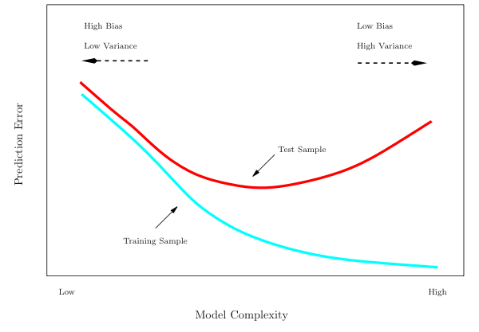
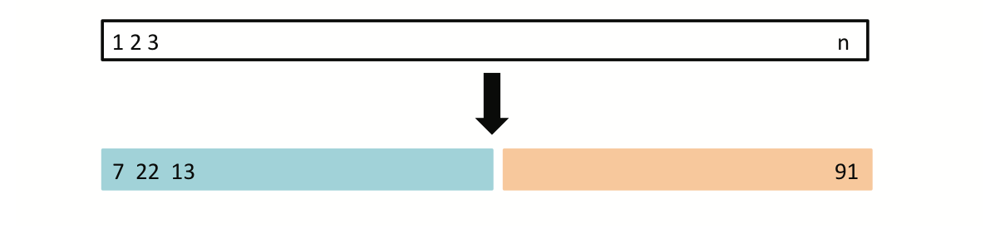
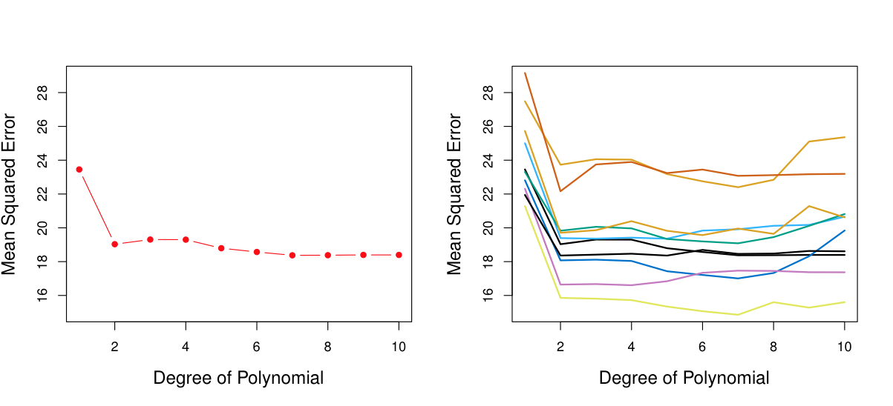
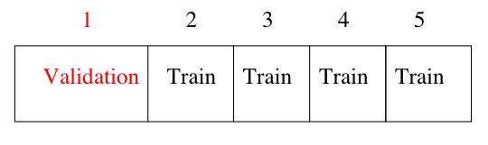
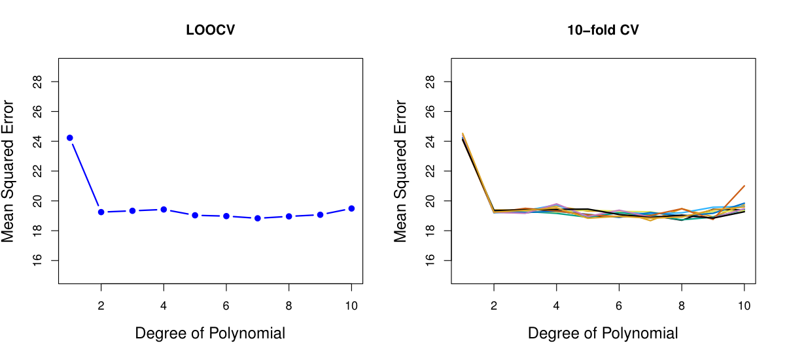
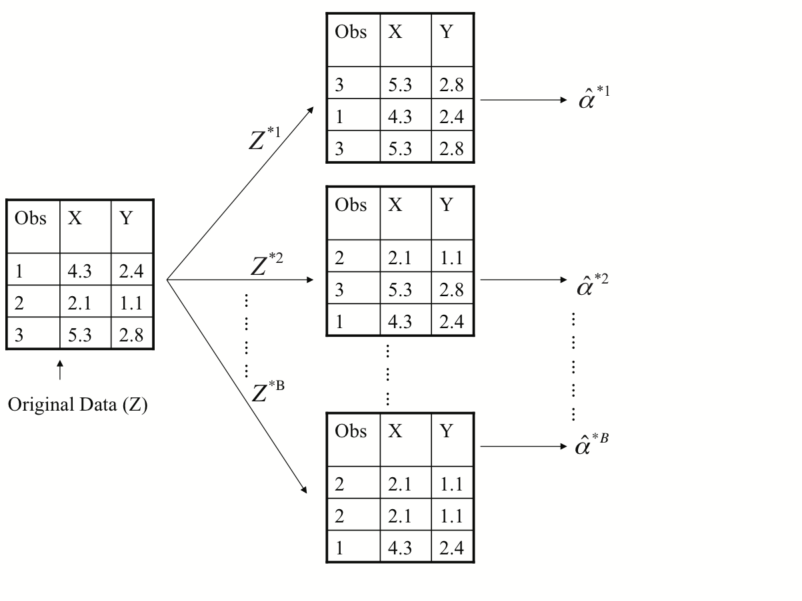
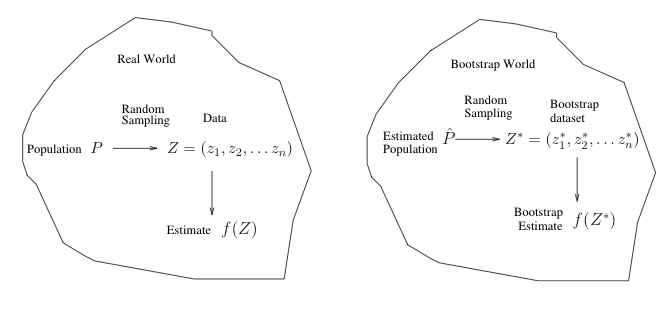

```{r setup, include=FALSE}
knitr::opts_chunk$set(echo = FALSE)
```

# Resampling methods

- we discuss two resampling methods: cross-validation and the bootstrap.
- these methods refit a model of interest to samples formed from the training set, in order to obtain additional information about the fitted model.
-  For example, they provide estimates of test-set prediction error, and the standard deviation and bias of our parameter estimates

# Training- versus Test-Set Performance

The training error rate often is quite different from the test error rate, and in particular the former can dramatically underestimate the latter.
     
```{r echo=FALSE, out.width='80%'}

```


# More on prediction-error estimates

- Best solution: a large designated test set. Often not available or not practical
- Some methods make a mathematical adjustment to the training error rate in order to estimate the test error rate. These include the $C_p$ statistic, AIC and BIC.
- Here we instead consider a class of methods that estimate the test error by holding out a subset of the training observations from the fitting process, and then applying the statistical learning method to those held out observations


# Validation-set approach

- Here we randomly divide the available set of samples into two parts: a training set and a validation or hold-out set.
- The model is fit on the training set, and the fitted model is used to predict the responses for the observations in the validation set.
- The resulting validation-set error provides an estimate of the test error. This is typically assessed using MSE in the case of a quantitative response and misclassification rate in the case of a qualitative (discrete) response.

     
```{r echo=FALSE, out.width='80%'}

```

# Example: automobile data
-  Want to compare linear vs higher-order polynomial terms in a linear regression
-  We randomly split the 392 observations into two sets, a training set containing 196 of the data points, and a validation set containing the remaining 196 observations.

```{r echo=FALSE, out.width='80%'}

```

# Drawbacks of validation set approach

- the validation estimate of the test error can be highly variable, depending on precisely which observations are included in the training set and which observations are included in the validation set.
- In the validation approach, only a subset of the observations --- those that are included in the training set rather than in the validation set --- are used to fit the model.
- This suggests that the validation set error may tend to overestimate the test error for the model fit on the entire data set. (different sample size).

# $K$-fold Cross-validation

- Widely used approach for estimating test error.
- Estimates can be used to select best model, and to give an idea of the test error of the final chosen model.
- Idea is to randomly divide the data into $K$ equal-sized parts. We leave out part $k$, fit the model to the other $K - 1$ parts (combined), and then obtain predictions for the left-out kth
part.
- This is done in turn for each part $k$ and then the results are combined.

```{r echo=FALSE, out.width='80%'}

```

# Details

- Let the $K$ parts be $C_1,\ldots,C_k$, where $C_k$ denotes the indices of the observations in part $k$. There are $n_k$ observations in part $k$.

-  the cross-validation error is
$$
        CV_K = \frac{1}{n} \sum_{k=1}^{K} \sum_{i \in C_k} (y_i - \hat f_{-k}(x_i))^2
$$
where $\hat f_{-k}(x_i)$ is the prediction of $y_i$ based on the data with part $k$ removed.
- if $K = 2$: split-sample cross-validation. Our CV error estimates are going to be biased upwards, because we are only training on half the data each time
- Setting $K = n$ yields $n$-fold or leave-one out cross-validation (LOOCV).


# How to choose $K$

- The bias-variance tradeoff, again!
- Choosing $K = 5$ or $K = 10$ seems to generally be a good tradeoff
- In each iteration we train on a fraction of (about) $(K- 1)/K$ the total training set,
        so this reduces the bias
- There is less overlap between the training sets across iterations, so the terms in
$$
         CV_K = \frac{1}{n} \sum_{k=1}^{K} \sum_{i \in C_k} (y_i - \hat f_{-k}(x_i))^2
$$
are not as correlated, and the error estimate has a smaller variance.

- The choices $K = 5$ or $K = 10$ are pretty much the standards, and people believe that these give good estimates of prediction error, but there is not really any theory supporting this

# Auto data revisited

```{r echo=FALSE, out.width='80%'}

```


# Cross-validation is a general tool

- So far we’ve looked at cross-validation for estimation under squared error loss, but it applies much more broadly than this
- For an arbitrary loss $l(y_i, \hat f(x_i))$, the cross-validation estimate of
    prediction error under $l$ is
$$
        CV_K = \frac{1}{n} \sum_{k=1}^{K} \sum_{i \in C_k} l(y_i, \hat f(x_i))
$$
- For example: for classification, each $y_i \in {0, 1}$, and we might want to use
        the 0-1 loss
$$
        l(y_i, \hat f(x_i)) = \begin{cases}
            0, &\text{ if }y_i = \hat f(x_i)\\
            1, &\text{ otherwise}
        \end{cases}
$$
- Cross-validation now gives us an estimate of misclassification error for a new observation. Usually in cross-validation for classification we try to balance the folds


# Cross-validation: right and wrong

- Consider a simple classifier applied to some two-class data:
  - Starting with 5000 predictors and 50 samples, find the 100 predictors having the largest correlation (how?) with the class labels.
  - We then apply a classifier such as logistic regression, using
only these 100 predictors.
- How do we estimate the test set performance of this classifier?
- Can we apply cross-validation in step 2, forgetting about step 1?

- No! This would ignore the fact that in Step 1, the procedure has already seen the labels of the training data, and made use of them.
- This is a form of training and must be included in the validation process.

# The Bootstrap

- The bootstrap is a flexible and powerful statistical tool that can be used to quantify the uncertainty associated with a given estimator or statistical learning method.
- It can provide an estimate of the standard error of a coefficient, or a
    confidence interval for that coefficient.
- For example, we have an estimator $\hat \alpha$ of $\alpha$ and we are interested in its s.d.
    (to construct confidence interval)
- $\hat \alpha$ is a function of the observations $(x_i,y_i)$, $i=1,\ldots,n$
- To estimate the standard deviation of $\hat \alpha$, we could simulate
    observations $(\tilde x_i, \tilde y_i)$, $i=1,\ldots,n$ which have the same distribution as $(x_i,y_i)$.
- A new estimate of $\alpha$ is obtained, called it $\tilde \alpha$
- repeat the process 1000 times, we have 1000 $\tilde \alpha$'s and the sample deviations of
    those 1000 $\tilde \alpha$'s can be used to estimate the s.d. of $\hat \alpha$.
    
# Now back to the real world

-  The procedure outlined above cannot be applied, because for real data we cannot generate new samples from the original population.
- However, the bootstrap approach allows us to use a computer to mimic the process of obtaining new data sets, so that we can estimate the variability of our estimate without generating additional samples.
- Rather than repeatedly obtaining independent data sets from the population, we instead
        obtain distinct data sets by repeatedly sampling observations from the original data set
        *with replacement*.
- Each of these ``bootstrap data sets'' is created by sampling with replacement, and is the same size as our original dataset. As a result some observations may appear more than once in a given bootstrap data set and some not at all.

# Example with just 3 observations

```{r echo=FALSE, out.width='80%'}

```

# Notations

- Denoting the first bootstrap data set by $Z^{*1}$, we use $Z^{*1}$ to
produce a new bootstrap estimate for $\alpha$, which we call $\hat \alpha^{*1}$
- this procedure is repeated $B$ times for some large value of $B$ (say 100 or 1000)
- we have $B$ different bootstrap data sets, $Z^{*1},\ldots,Z^{*B}$, and $B$
       corresponding $\alpha$ estimates, $\hat \alpha^{*1},\ldots,\hat \alpha^{*B}$
- We estimate the standard error of these bootstrap estimates using the formula
$$
       SE_{B}(\hat \alpha) = \sqrt{\frac{1}{B-1}\sum_{r=1}^{B} (\hat \alpha^{*r} - \bar{\hat
       \alpha}^*)}
$$
where $\bar{\hat \alpha}^*$ is the average of $\hat \alpha^{*r}$'s.

- This serves as an estimate of the standard error of $\hat \alpha$ estimated from the original
       data set.
       
       
# A general picture for the bootstrap
```{r echo=FALSE, out.width='100%'}

```

# Other uses of the bootstrap
- Primarily used to obtain standard errors of an estimate.
- Also provides approximate confidence intervals for a population parameter.
- Consider the 2.5th and 97.5 percentile of $\hat \alpha^{*1},\ldots,\hat \alpha^{*B}$
- The above interval is called a Bootstrap Percentile confidence interval. It is the simplest method (among many approaches) for obtaining a confidence interval from the bootstrap.


# Can the bootstrap estimate prediction error?
- In cross-validation, each of the $K$ validation folds is distinct from the other $K-1$ folds used for training: there is no overlap. This is crucial for its success.
-  To estimate prediction error using the bootstrap, we could think about using each bootstrap dataset as our training sample, and the original sample as our validation sample.
-  But each bootstrap sample has significant overlap with the original data. About two-thirds of the original data points appear in each bootstrap sample.
-  This will cause the bootstrap to seriously underestimate the true prediction error.
- A correct way is to use the "out-of-bag" sample as out validation sample

# Permutation tests

- A permutation test gives a simple way to compute the sampling distribution for any
        test statistic, under the strong null hypothesis that a set of genetic variants has
        absolutely no effect on the outcome.
- To estimate the sampling distribution of the test statistic we need many samples generated under the strong null hypothesis.
- It could be achieved by randomly shuffling.
- For classification problems: randomly shuffle the labels of the observations.
- If the null hypothesis is true the shuffled data sets should look like the real data, otherwise they should look different from the real data.
- The ranking of the real test statistic among the shuffled test statistics gives a
        $p$-value.
- Construct CI by using Permutation tests? No!
