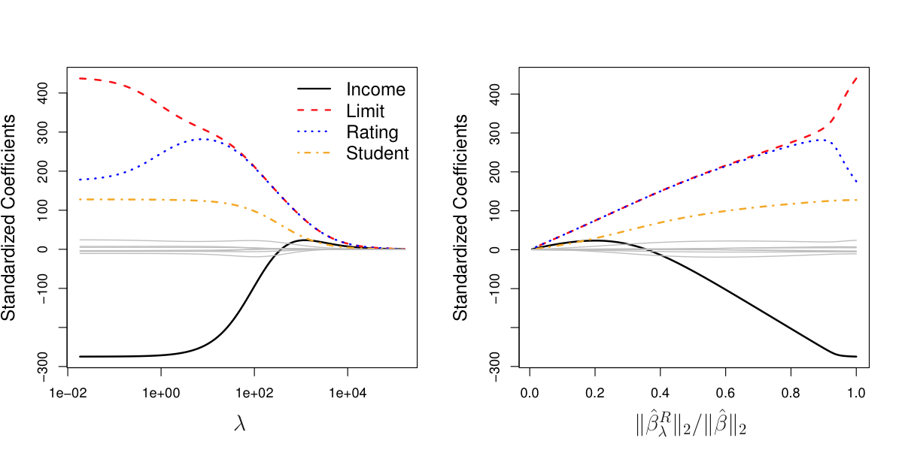
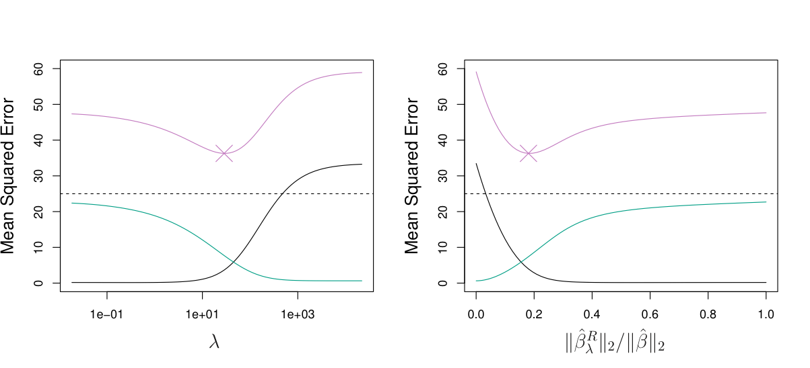
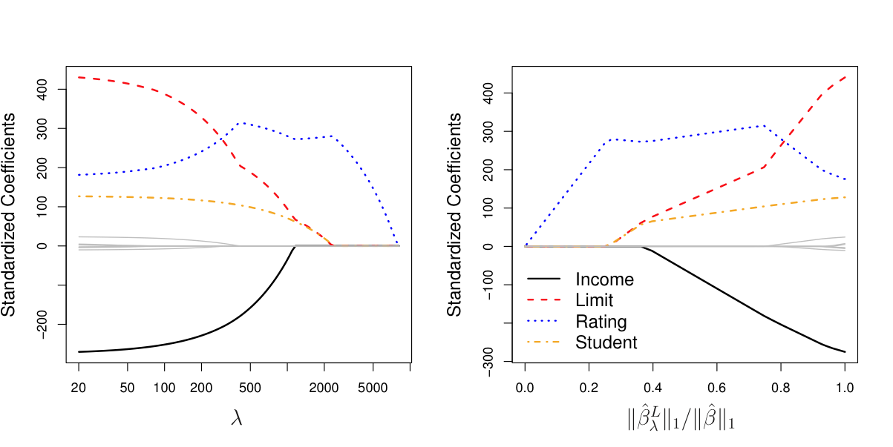
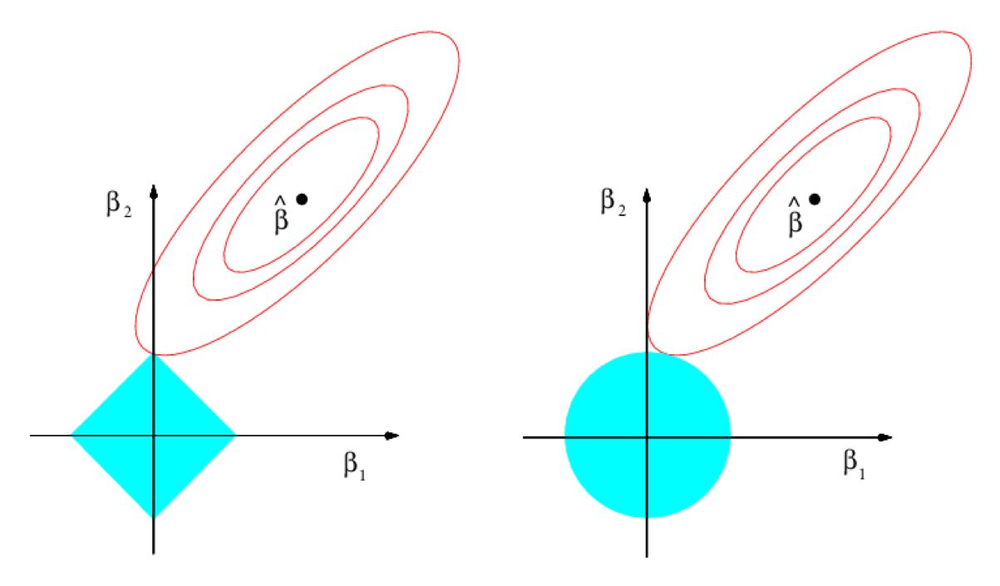
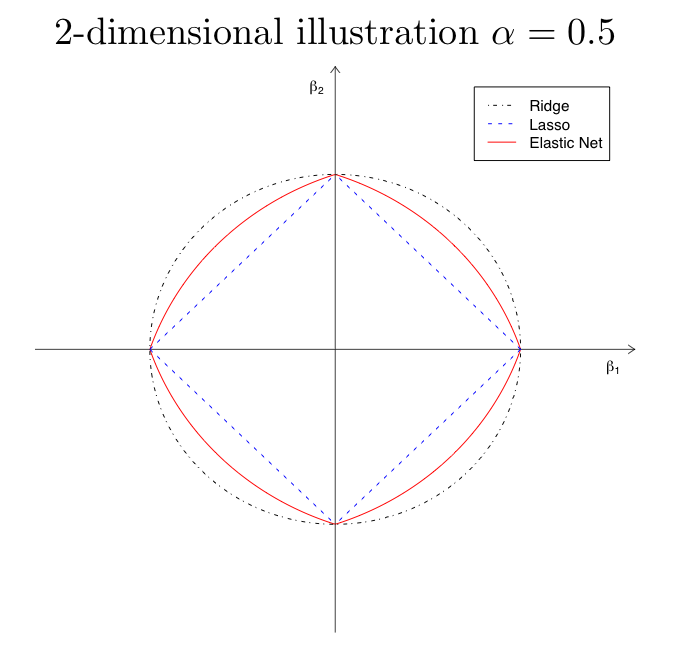
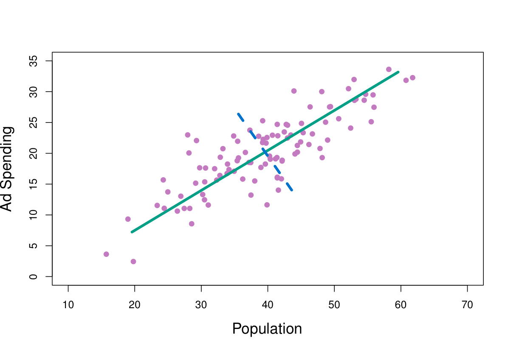
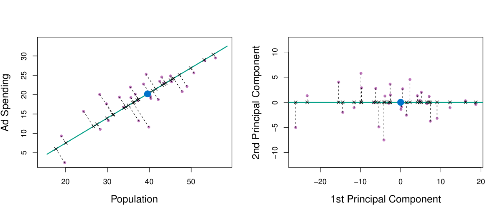
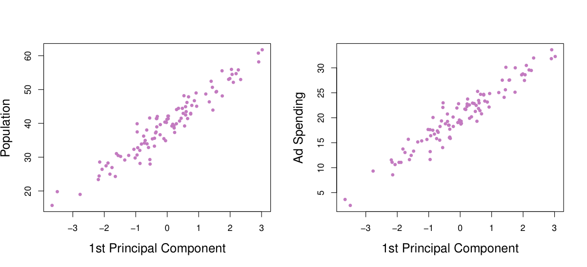
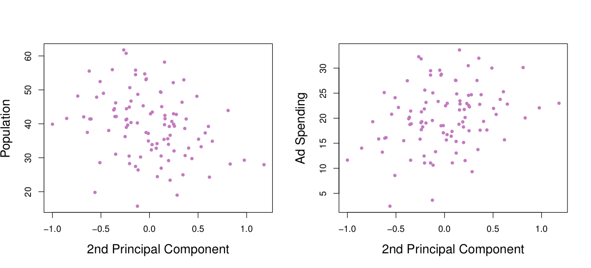
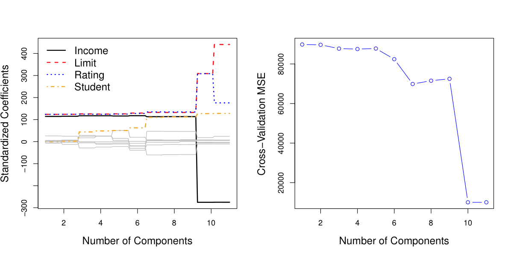

```{r setup, include=FALSE}
knitr::opts_chunk$set(echo = FALSE)
```


# Three classes of methods

- Subset Selection. We identify a subset of the p predictors
that we believe to be related to the response. We then fit a
model using least squares on the reduced set of variables.
- Shrinkage. We fit a model involving all $p$ predictors, but
the estimated coefficients are shrunken towards zero
relative to the least squares estimates. This shrinkage (also
known as regularization) has the effect of reducing variance
and can also perform variable selection.
- Dimension Reduction. We project the $p$ predictors into a
$M$-dimensional subspace ($M < p$).  This is achieved by
computing $M$ different linear combinations, or projections,
of the variables. Then these M projections are used as
predictors to fit a linear regression model by least squares.


# Subset Selection

- Best subset and stepwise model selection procedures

    - Best Subset Selection (global optimization)
        - Fit all $2^p$ models

    - Stepwise Selection (local optimization)
        - A greedy search 


# Shrinkage Methods

- Ridge regression, Lasso and Elastic net
- The subset selection methods use least squares to fit a
linear model that contains a subset of the predictors.
- As an alternative, we can fit a model containing all p
predictors using a technique that constrains or regularizes
the coefficient estimates, or equivalently, that shrinks the
coefficient estimates towards zero.
- It may not be immediately obvious why such a constraint
should improve the fit, but it turns out that shrinking the
coefficient estimates can significantly reduce their variance.


# Ridge regression

- Ridge regression is like least squares but shrinks the estimated coefficients towards
zero. Given a response vector $y$ and a predictor matrix $X$, the ridge regression
coefficients are defined as
$$
\hat \beta^{\text{ridge}} = \underset{\beta}{\text{argmin}} \sum_{i=1}^{n} (y_i-\beta_0- x_{1i} \beta_1 -\ldots)^2 + \lambda
\sum_{j=1}^{p} \beta_j^2
$$
- Here $\lambda\ge 0$ is a turning parameter, which controls the strength of the penalty
term.
- When $\lambda=0$, we get the linear regression estimate
- WHen $\lambda=\infty$, we get $\hat \beta^{\text{ridge}}=0$
- For $\lambda$ in between, we are balancing two ideas: fitting a linear model of $y$ on
$X$, and shrinking the coefficients


# Ridge regression: continue

- As with least squares, ridge regression seeks coefficient
estimates that fit the data well, by making the RSS small.
- However, the second term, $\lambda \sum_{j=1}^{p} \beta_j^2$, called a shrinkage
penalty, is small when $\beta$'s are close to zero, and so it has the effect of shrinking the estimates of $\beta$'s towards zero.

- The tuning parameter $\lambda$ serves to control the relative
impact of these two terms on the regression coefficient
estimates.

- Selecting a good value for $\lambda$ is critical; cross-validation is
used for this.


# Credit data example

     
```{r echo=FALSE, out.width='60%'}

```

- In the left-hand panel, each curve corresponds to the ridge
regression coefficient estimate for one of the ten variables,
plotted as a function of $\lambda$

- The right-hand panel displays the same ridge coefficient
estimates as the left-hand panel, but instead of displaying
$\lambda$ on the x-axis, we now display

$$
\| \hat \beta^{R}_\lambda \|_2 / \| \hat \beta \|_2
$$

- $\|  \beta \|_2 = \sqrt{\sum_j \beta_j^2}$ is called the $l_2$ norm.


# Ridge regression: scaling of predictors

- The standard least squares coefficient estimates are scale
equivariant: multipying $x$ by a constant $c$ simply leads to
a scaling of the least squares coefficient estimates by a
factor of $1/c$. In other words, regardless of how $x$ is scaled, 
$\hat \beta x$ will reamin the same.

- In contrast, the ridge regression coefficient estimates can
change substantially when multiplying a given predictor by
a constant, due to the sum of squared coefficients term in
the penalty part of the ridge regression objective function.

- Therefore, it is best to apply ridge regression after
standardizing the predictors, for example,

$$
\tilde x = x / sd_x
$$
which makes sure that the s.d. of $\tilde x$ is 1.

# Why Does Ridge Regression Improve Over Least Squares?


Simulated data with $n = 50$ observations, $p = 45$ predictors, all having
nonzero coefficients. Squared bias (black), variance (green), and test
mean squared error (purple) for the ridge regression predictions on a
simulated data set, as a function of $\lambda$ and $\| \hat \beta^{R}_\lambda \|_2 / \| \hat \beta \|_2$. The
horizontal dashed lines indicate the minimum possible MSE. The
purple crosses indicate the ridge regression models for which the MSE
is smallest

     
```{r echo=FALSE, out.width='60%'}

```


# The Lasso

- Ridge regression does have one obvious disadvantage:
unlike subset selection, which will generally select models
that involve just a subset of the variables, ridge regression
will include all $p$ predictors in the final model

- The Lasso is a relatively recent alternative to ridge
regression that overcomes this disadvantage. The lasso
coefficients, $\beta^L_\lambda$, minimize the quantity

$$
\hat \beta^{\text{L}} = \underset{\beta}{\text{argmin}} \sum_{i=1}^{n} (y_i- \beta_0 - x_{1i} \beta_1 -\ldots)^2 + \lambda
\sum_{j=1}^{p} |\beta_j|
$$
In statistics language, the lasso uses an $l_1$ penalty instead of an $l_2$ penalty.


# The Lasso: continued

- As with ridge regression, the lasso shrinks the coefficient
estimates towards zero.
- However, in the case of the lasso, the $l_1$ penalty has the
effect of forcing some of the coefficient estimates to be
exactly equal to zero when the tuning parameter $\lambda$ is
sufficiently large.
- Hence, much like best subset selection, the lasso performs
variable selection.
- We say that the lasso yields sparse models — that is,
models that involve only a subset of the variables.
- As in ridge regression, selecting a good value of $\lambda$ for the
lasso is critical; cross-validation is again the method of
choice.

# Example: Credit dataset

```{r echo=FALSE, out.width='100%'}

```


# The Variable Selection Property of the Lasso
- Why is it that the lasso, unlike ridge regression, results in
coefficient estimates that are exactly equal to zero?

- One can show that the lasso and ridge regression coefficient
estimates solve the problems

$$
\text{minimize } \sum_{i=1}^{n} (y_i- \beta_0 - x_{1i} \beta_1 -\ldots)^2 \quad \text{subject to } \sum_{j=1}^{p} |\beta_j| <s
$$

$$
\text{minimize } \sum_{i=1}^{n} (y_i- \beta_0 - x_{1i} \beta_1 -\ldots)^2 \quad \text{subject to } \sum_{j=1}^{p} \beta_j^2 <s
$$
respectively.

# The Variable Selection Property of the Lasso (continue)
```{r echo=FALSE, out.width='60%'}

```


# Comparing the Lasso and Ridge Regression

- neither ridge regression nor the lasso would universally dominate the other

- In general, one might expect the lasso to perform better
when the response is a function of only a relatively small
number of predictors.

- However, the number of predictors that is related to the
response is never known a priori for real data sets.

- A technique such as cross-validation can be used in order
to determine which approach is better on a particular data
set.


# Elastic Net

- If $p > n$, the lasso selects at most $n$ variables. The number of selected predictors
        is bounded by the number of samples.
- Grouped variables: the lasso fails to do grouped selection. It tends to select one
        variable from a group and ignore the others.
        
# Elastic Net regularization

- The Naive Elastic net estimate is defined as
$$        
        \hat \beta^{\text{naive}} = \underset{\beta}{\text{argmin}} \sum_{i=1}^{n} (y_i- \beta_0- \beta_1 x_{1i} -\ldots)^2 + \lambda_2
        \sum_{j=1}^{p} \beta_j^2 + \lambda_1 \sum_{j=1}^{p} |\beta_j|
$$
- The $l_1$ part of the penalty generates a sparse model
- The quadratic part of the penalty
  - Removes the limitation on the number of selected variables
  - Encourages grouping effect
  - Stabilizes the $l_1$ regularization path

- Rewrite elastic net

$$
        \hat \beta^{\text{naive}} = \underset{\beta}{\text{argmin}} \sum_{i=1}^{n} (y_i- \beta_0- \beta_1 x_{1i} -\ldots)^2 +
        \lambda
        \left[\alpha \sum_{j=1}^{p} \beta_j^2 + (1-\alpha) \sum_{j=1}^{p} |\beta_j|\right]
$$

# Geometry of the elastic net

- The elastic net penalty: $\alpha \sum_{j=1}^{p} \beta_j^2 + (1-\alpha) \sum_{j=1}^{p} |\beta_j|$
- Singularities at the vertexes (necessary for sparsity)
- Strict convex edges. The strength of convexity varies with $\alpha$ (grouping)

```{r echo=FALSE, out.width='40%'}

```

# A simple illustration: elastic net vs. lasso

- Two independent 'hidden' factors $z_1$ and $z_2$
$$
z_1 \sim U(0,20),\quad z_2 \sim U(0,20)
$$

- Generate the response vector $y = z_1 + 0.1 \times z_2 + \varepsilon$,
        $\varepsilon\sim N(0,1)$

- Suppose only observe predictors 

$$
x_1 = z_1 + \varepsilon_1, \quad x_2 = -z_1 + \varepsilon_2, \quad x_3 = z_1 +
\varepsilon_3
$$
$$
x_4 = z_2 + \varepsilon_4, \quad x_5 = -z_2 + \varepsilon_5, \quad x_6 = z_2 +
\varepsilon_6
$$

- Fit $y$ on $x_1,\ldots,x_6$

- An 'oracle' would identify $x_1$, $x_2$ and $x_3$ (the $z_1$ group) as the most
        important variables.


# A simple illustration: elastic net vs. lasso (cont)

```{r echo=FALSE, out.width='50%'}

```
```{r echo=FALSE, out.width='50%'}

```

Left: Lasso; Right: Elastic Net with $\alpha=0.5$


# Deficiency of the 'naive' elastic net

- Empirical evidence shows the naive elastic net does not perform satisfactorily unless
        it is very close to either ridge or the lasso $\alpha=0$ or $\alpha=1$
- The naive elastic net estimator is a two-stage procedure: for each fixed $\lambda_2$
        we first find the ridge regression coefficients, and then we do the lasso type shrinkage along the lasso coefficient solution paths.


- the coefficients are doubly penalized

-  $$
        \hat \beta^{\text{enet}} = (1+\lambda_2) \hat \beta^{\text{naive}}
   $$

# Dimension Reduction Methods

- The methods that we have discussed so far in this chapter
have involved fitting linear regression models, via least
squares or a shrunken approach, using the original
predictors

- We now explore a class of approaches that transform the
predictors and then fit a least squares model using the
transformed variables. We will refer to these techniques as
dimension reduction methods.


# Dimension Reduction Methods: details

- Let $Z_1, Z_2, \ldots, Z_M$ represent $M < p$ linear combinations of
our original $p$ predictors. That is,

$$
Z_m = \sum_{j=1}^p  \phi_{mj} X_j
$$
for some constants $\phi_{m1},\ldots,\phi_{mp}$

- We can then fit the linear regression model,
$$
y_i = \theta_0 + \sum_{m=1}^M \theta_m z_{im} + \varepsilon, \quad i = 1,\ldots,n
$$
using ordinary least squares.

-  If the constants $\phi_{m1},\ldots,\phi_{mp}$ are chosen
wisely, then such dimension reduction approaches can often
outperform OLS regression

# Principal Components Regression

- The first principal component is that (normalized) linear
combination of the variables with the largest variance.
- The second principal component has largest variance,
subject to being uncorrelated with the first.
- And so on

- Hence with many correlated original variables, we replace
them with a small set of principal components that capture
their joint variation.

# Pictures of PCA


```{r echo=FALSE, out.width='70%'}

```

The population size (pop) and ad spending (ad) for 100
different cities are shown as purple circles. The green solid line
indicates the first principal component, and the blue dashed line
indicates the second principal component.

# Pictures of PCA: continued


```{r echo=FALSE, out.width='70%'}

```

A subset of the advertising data. Left: The first principal
component, chosen to minimize the sum of the squared
perpendicular distances to each point, is shown in green. These
distances are represented using the black dashed line segments.
Right: The left-hand panel has been rotated so that the first
principal component lies on the $x$-axis.

# Pictures of PCA: continued

```{r echo=FALSE, out.width='70%'}


```


# Choosing the number of directions $M$

```{r echo=FALSE, out.width='70%'}

```

Left: PCR standardized coefficient estimates on the Credit
data set for different values of $M$. Right: The 10-fold cross
validation MSE obtained using PCR, as a function of $M$.

# Partial Least Squares

- PCR identifies linear combinations, or directions, that best
represent the predictors  $X_1,\ldots,X_p$
- These directions are identified in an unsupervised way, since
the response $Y$ is not used to help determine the principal
component directions.
- That is, the response does not supervise the identification
of the principal components.
- Consequently, PCR suffers from a potentially serious
drawback: there is no guarantee that the directions that
best explain the predictors will also be the best directions
to use for predicting the respons


# Partial Least Squares: continued

- Like PCR, PLS is a dimension reduction method, which
first identifies a new set of features $Z_1,\ldots,Z_M$ that are
linear combinations of the original features, and then fits a
linear model via OLS using these $M$ new features.

- But unlike PCR, PLS identifies these new features in a
supervised way – that is, it makes use of the response Y in
order to identify new features that not only approximate
the old features well, but also that are related to the
response.

- Roughly speaking, the PLS approach attempts to find
directions that help explain both the response and the
predictors.

# Details of Partial Least Squares

- After standardizing the p predictors, PLS computes the
first direction $Z_1$ by setting each $\phi_{1j}$ equal to the
coefficient from the simple linear regression of $Y$ onto $X_j$.
- One can show that this coefficient is proportional to the
correlation between $Y$ and $X_j$.
- Hence, in computing $Z_1 = \sum_{j=1}^p \phi_{1j} X_j$ , PLS places the
highest weight on the variables that are most strongly
related to the response.
- Subsequent directions are found by taking residuals and
then repeating the above prescription.
