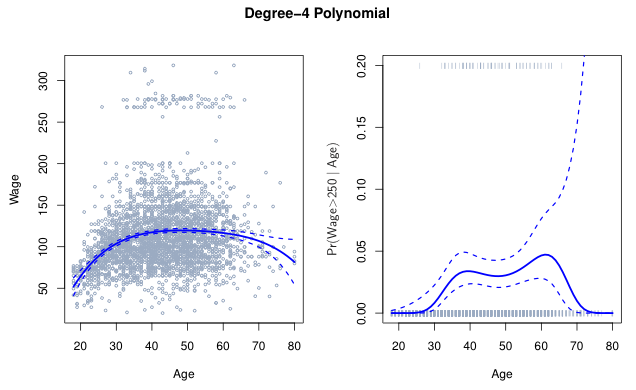
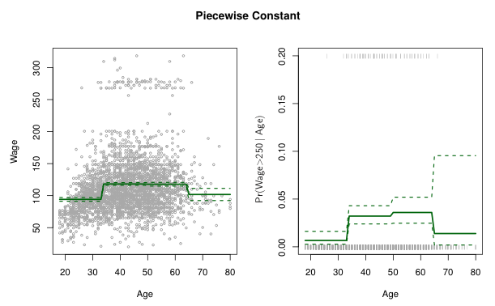
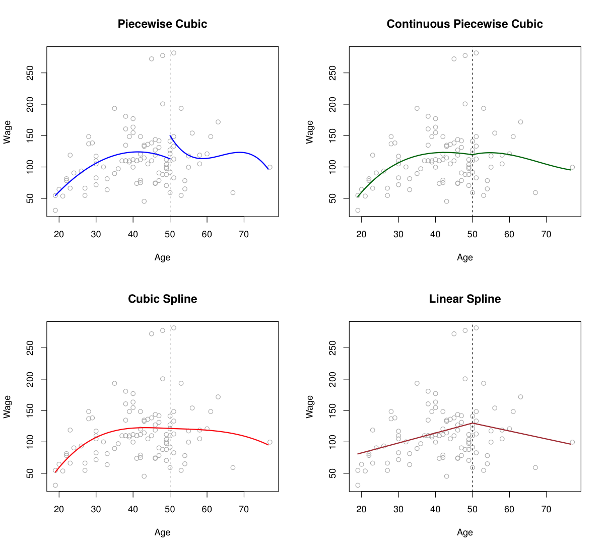
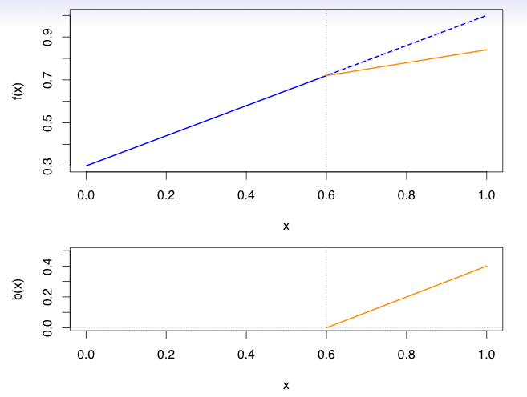
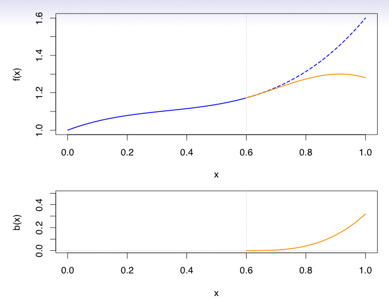
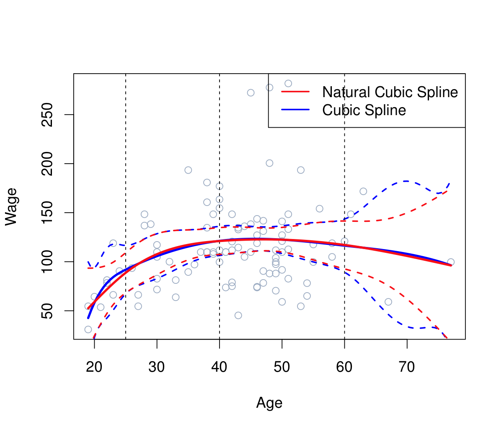
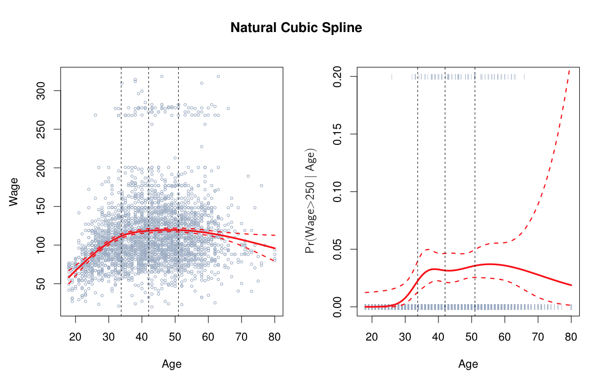
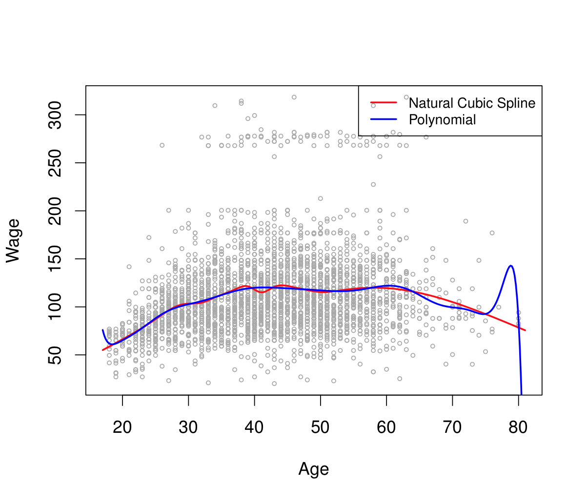
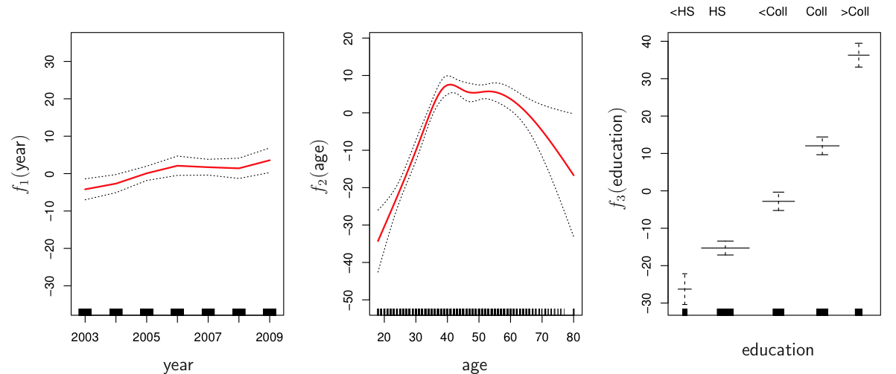

```{r setup, include=FALSE}
knitr::opts_chunk$set(echo = FALSE)
```


# Moving Beyond Linearity

- The truth is never linear! Or almost never!
- But often the linearity assumption is good enough.
- When its not ...
    - polynomials,
    - step functions,
    - splines,
    - local regression, and
    - generalized additive models
    
    offer a lot of flexibility, without losing the ease and interpretability of linear models.

# Polynomial Regression

$$
    y_i = \beta_0 + \beta_1 x_i + \beta_2 x_i^2 +\ldots+ \beta_d x_i^d + \varepsilon_i
$$

```{r echo=FALSE, out.width='60%'}

```

Can fit using $\texttt{y} \sim \texttt{poly(x, degree = 3)}$ in formula.

# Step Functions

 Another way of creating transformations of a variable --- cut the variable into distinct
    regions.
$$
    C_1(X)=I(X<35),C_2(X)=I(35\le x < 50),\ldots, C_k = I(X>65)
$$

```{r echo=FALSE, out.width='60%'}

```

# Step Functions (cont.)

- Easy to work with. Creates a series of dummy variables representing each group.
- In R: $\texttt{cut(age,c(18,25,40,65,90))}$
- Choice of cutpoints or knots can be problematic. For creating nonlinearities,
smoother 
- alternatives such as splines are available.

# Piecewise Polynomials

- Instead of a single polynomial in $X$ over its whole domain, we can rather use different polynomials in regions defined by knots. E.g. (see figure)
- Better to add constraints to the polynomials, e.g. continuity, differentiability.
- Splines have the "maximum" amount of continuity.


```{r echo=FALSE, out.width='50%'}

```

# Linear Splines

- A linear spline with knots at $\xi_k, k=1,\ldots,K$ is a piecewise linear polynomial
continuous at each knot.

```{r echo=FALSE, out.width='50%'}

```

# Linear Splines: Details

- We can represent this model as
$$
y_i = \beta_0 + \beta_1 b_1(x_i) + \beta_2 b_2(x_i) + \ldots + + \beta_{K+1} b_{K+1}(x_i) +
\varepsilon
$$$
where the $b_k$ are basis functions.
$$
\begin{aligned}
    b_1(x)&= x\\
    b_{k+1}(x) &= (x-\xi_k)_+, \quad k = 1,\ldots,K
\end{aligned}
$$

- Here $(\cdot)_+$ means positive part, i.e.
$$
(x-\xi_k)_+ = \begin{cases}
    x-\xi_k, &\text{ if } x > \xi_l\\
    0, &\text{ otherwise}
\end{cases}
$$


# Cubic Splines

- A cubic spline with knots at $\xi_k, k=1,\ldots,K$ is a piecewise cubic polynomial
continuous second derivatives at each knot.
- Again we can represent this model with truncated power basis functions
$$
y_i = \beta_0 + \beta_1 b_1(x_i) + \beta_2 b_2(x_i) + \ldots + + \beta_{K+3} b_{K+1}(x_i) +
\varepsilon
$$
where
$$
\begin{aligned}
b_1(x)&= x\\
b_2(x)&= x^2\\
b_3(x)&= x^3\\
b_{k+3}(x) &= (x-\xi_k)^3_+, \quad k = 1,\ldots,K
\end{aligned}
$$

# Cubic Splines (cont)

```{r echo=FALSE, out.width='50%'}

```

# Natural Cubic Splines

- A natural cubic spline extrapolates linearly beyond the boundary knots.

- This adds $4 = 2 \times 2$ extra constraints, and allows us to put more internal knots
for the same degrees of freedom as a regular cubic spline.

```{r echo=FALSE, out.width='50%'}


```

# Knot Placement

- One strategy is to decide $K$, the number of knots, and then place them at appropriate quantiles of the observed $X$.
- A cubic spline with $K$ knots has $K + 4$ parameters or degrees of freedom.
- A natural spline with $K$ knots has $K$ degrees of freedom


```{r echo=FALSE, out.width='50%'}

```

Comparison of a degree-14 polynomial and a natural cubic spline, each with 15 df


# Splines with Penalty


- Fixed df splines are useful tools, but are not truly nonparametric
- Choices regarding the number of knots and where they are located are fundamentally parametric choices and have a large effect on the fit
- Furthermore, assuming that you place knots at quantiles, models will not be nested inside each other, which complicates hypothesis testing
    - P-Spline: We have the same spline model with a much denser grid of knots.
    The estimates are obtained from ridge or lasso regression.

    - Smoothing Spline: We can avoid the knot selection problem altogether via
    the nonparametric
    formulation introduced at the beginning of lecture: choose the function $g$ that minimizes
$$
    \sum_{i=1}^{n} (y_i - g(x_i))^2 + \lambda \int g''(t)^2 dt
$$

# Smoothing Splines

- Consider this criterion for fitting a smooth function $g(\cdot)$
$$
\hat g(\cdot) = \underset{g}{\text{argmin}} \sum_{i=1}^{n} (y_i - g(x_i))^2 + \lambda \int g''(t)^2 dt
$$
- The first term is RSS, and tries to make $g(x)$ match the data at each $x_i$.
- The second term is a roughness penalty and controls how wiggly $g(x)$ is. It is
modulated by the tuning parameter $\lambda\ge 0$
- The smaller $\lambda$, the more wiggly the function, eventually interpolating $y_i$
when $\lambda = 0$.
- As $\lambda\to \infty$, the function $s$ becomes linear.

# Smoothing Splines continued


- The solution is a natural cubic spline, with a knot at every unique value of $x_i$. The
roughness penalty still controls the roughness via $\lambda$.

- Smoothing splines avoid the knot-selection issue, leaving a single $\lambda$ to be
chosen.
- In R, the function `smooth.spline()` will fit a smoothing spline
- The vector of $n$ fitted values can be written as
$$
\hat y_\lambda = S_\lambda y
$$
where $S_\lambda$ is a $n\times n$ matrix (depends on $x_i$ and $\lambda$)
- The effective degrees of freedom are given by $\text{trace}(S_\lambda)$

# Choosing $\lambda$

- We can specify df rather than $\lambda$!
- In R: `smooth.spline(age, wage, df = 10)`
- The leave-one-out (LOO) cross-validated error is given by
$$
\sum_{i=1}^{n} (y_i - \hat g_{\lambda}^{(-i)} (x_i))^2 = \sum_{i=1}^{n} \left[\frac{y_i -
\hat g_\lambda(x_i)} {1- \{S_\lambda\}_{ii}}\right]^2
$$
- In R: `smooth.spline(age, wage, cv = TRUE)`

# Generalized additive function


A natural way to extend the multiple linear regression model is

$$
y_i = \beta_0 + \beta_1 f(x_{i1}) +\ldots + + \beta_p f(x_{ip}) + \varepsilon
$$

Take, for example, natural splines, and consider the task of fitting the model
$\text{wage} = \beta_0 + f_1(\text{year}) + f_2(\text{age}) + f_3(\text{education}) + \varepsilon$


```{r echo=FALSE, out.width='50%'}

```

#  Pros and Cons of GAMs

Pros:

- GAMs allow us to fit a non-linear $f_j$ to each $X_j$, so that we can automatically model non-linear relationships that standard linear regression will miss. This means that we do not need to manually try out many different transformations on each variable individually.

- The non-linear fits can potentially make more accurate predictions for the response $Y$.

- Because the model is additive, we can still examine the effect of each $X_j$ on $Y$ individually while holding all of the other variables fixed. Hence if we are interested in inference, GAMs provide a useful representation.

- The smoothness of the function $f_j$ for the variable $X_j$ can be summarized via degrees of freedom.

Cons:

- The main limitation of GAMs is that the model is restricted to be additive.