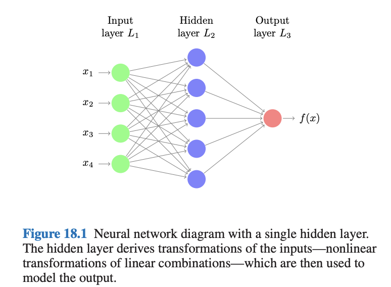
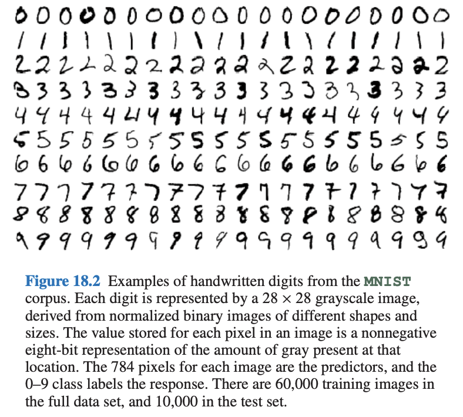
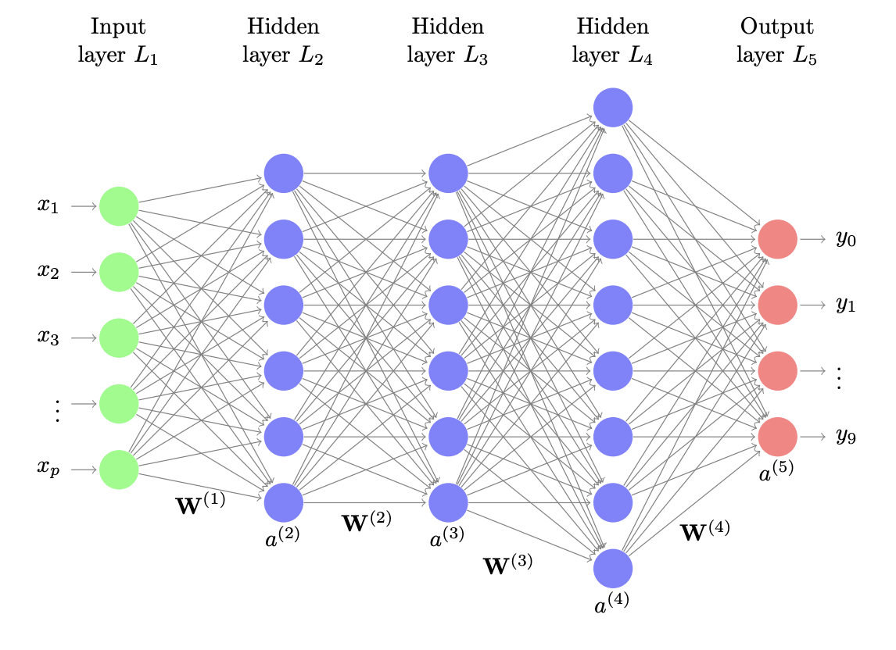
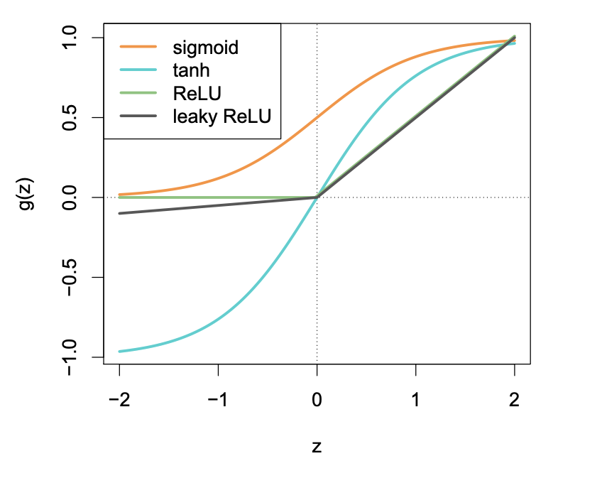
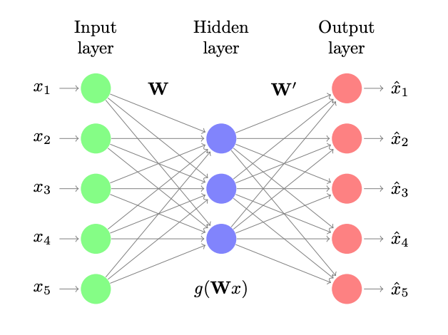
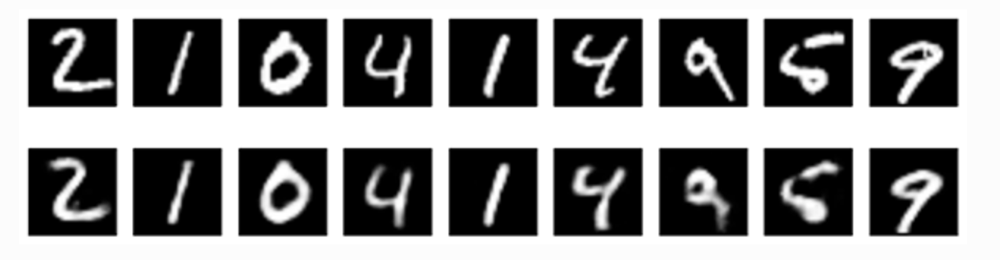
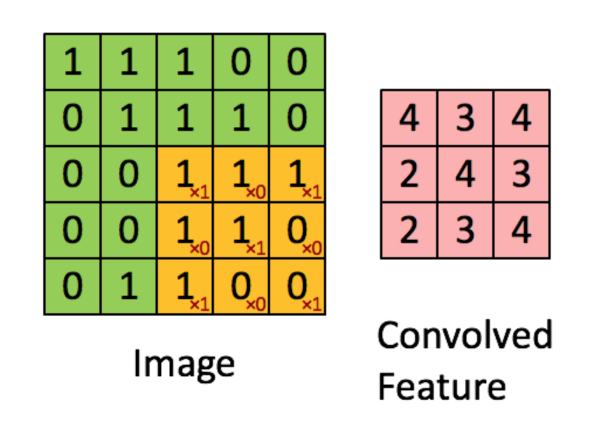
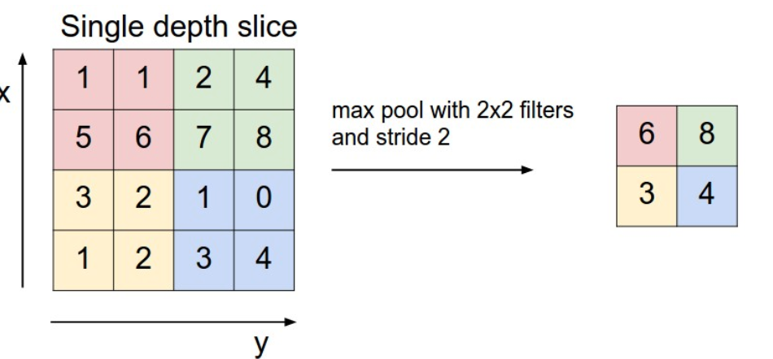
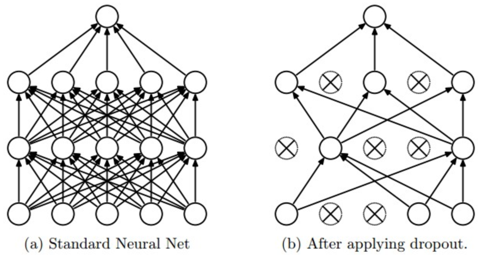

```{r setup, include=FALSE}
knitr::opts_chunk$set(echo = FALSE)
```


## Neural Networks and Deep Learning
-  Neural networks (NNs) were introduced in 1980s
- inspired by the architecture of the human brain
     
```{r echo=FALSE, out.width='80%'}

```


## Neural Networks and Deep Learning
<div style="float: left; width: 50%;">
```{r echo=FALSE, out.width='100%'}

```
</div>

<div style="float: right; width: 50%;">
- There are four predictors or inputs $x_j$
- hidden units: $a_l = g(w_{l0}^{(1)} + \sum_{j=1}^4 w_{lj}^{(1)} x_j)$
- output unit: $0 = g(w_{0}^{(2)} + \sum_{l=1}^5 w_{l}^{(2)} a_l)$

</div>

## Neural Networks and Deep Learning

<div style="float: left; width: 50%;">
```{r echo=FALSE, out.width='100%'}

```
</div>

<div style="float: right; width: 50%;">

- some NN terminology
- the units are called *neurons*
- the intercepts $w_{l0}^{(1)}$ are called *bias*
- the function $g$ is a non linear function, for example sigmoid function (equivalent to the logit function)
- the function $h$ is typically the identity function for quantitative regression and a sigmoid function for binary regression.
</div>


## What’s the big deal?

A statistician may say: A neural network is just a nonlinear model, not too different from many other
generalizations of linear models.

But..

NNs could be scaled up and generalized in a variety of way
-  many hidden units in a layer
- multiple hidden layer
-  weight sharing
- a variety of colorful forms of regularization
- innovative learning algorithm
- most importantly, the community

After enjoying considerable popularity for a number of years, neural
networks were somewhat sidelined by new inventions in the mid 1990s,
such as boosting and SVMs.

Then they re-emerged with a vengeance after 2010—the
reincarnation now being called **deep learning**. 

## Handwritten Digit Problem

```{r echo=FALSE, out.width='70%'}

```

---

```{r echo=FALSE, out.width='70%'}

```

A predictiion could be represented by the function $f(x; \mathcal{W})$ where $\mathcal{W}$ is the collection of all weights.

Our task is to minimize a particular loss function
$$
\frac{1}{n} \sum_{i=1}^n L[y_i, f(x_i, \mathcal{W})]
$$


## Computation

- In the early days the minimization was not computationally feasible, especially when special
structure is imposed on the weight vectors.
- Today, there are fairly automatic system for fitting NNs. Most of them use some form of gradient descent.

- For reasons which are similar to ridge, lasso and elatic net regression, penalty/ regularization can be added to the loss

$$
\frac{1}{n} \sum_{i=1}^n L[y_i, f(x_i, \mathcal{W})] + \lambda J(\mathcal{W})
$$
where $J(\mathcal{W})$ is a non negative regularization term. One common choice is $\frac{1}{2} \sum_{kjl} {w_{lj}^{(k)}}^2$.
We know it as the ridge penalty, and it's also known as the weight-decay penalty.

## Algorithms

- Backpropagation is a most common algorithm to fit a NN.
    - update the weights by using one observation at a time
    
- Stochastic Gradient Descent Methods
    - update the weights by using a random batch of observations at a time
   
- Accelerated Gradient Methods
    - allow previous iterations to build up momentum and influence the current iterations

## Choice of Nonlinearities
There are a number of activation functions $g^{(k)}$

```{r echo=FALSE, out.width='70%'}

```


## Autoencoder (unsupervised training)

- An autoencoder is a special neural network for computing a type of nonlinear principal-component decompositin


```{r echo=FALSE, out.width='50%'}

```


```{r echo=FALSE, out.width='70%'}

```


## Convolutional NN

It is a special layer for handling images. CNNs consist of two special types of layers - "convolve" and "pool".

<div style="float: left; width: 50%;">
The "convolve" layer applies a bunch of filters to the images.

```{r echo=FALSE, out.width='70%'}

```
</div>

<div style="float: right; width: 50%;">
The "pool" layer is used to reduce the (filtered) image pixel sizes.
```{r echo=FALSE, out.width='70%'}

```
</div>


## Dropout

Dropout is a technique used to avoid overfitting on neural networks.

- This is a form of regularization that is performed when learning a network

- The idea is to randomly set a node to zero with probability $\phi$

```{r echo=FALSE, out.width='70%'}

```

